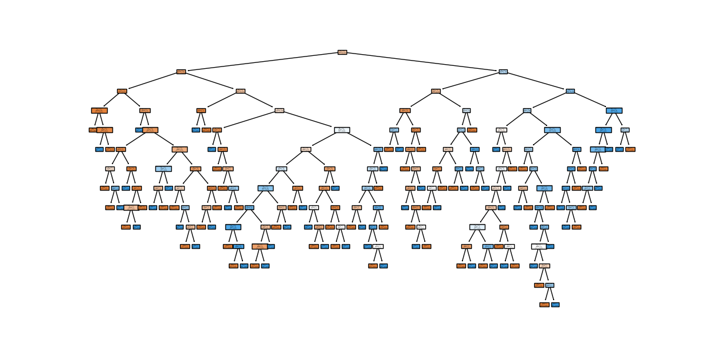

# Árbol de Decisión para la Predicción de Diabetes

Este proyecto implementa un árbol de decisión utilizando la biblioteca scikit-learn en Python para predecir la diabetes en pacientes. Utiliza el conjunto de datos "diabetes.csv" que contiene información de diagnóstico.

### Requisitos

- Python 3.x instalado en tu sistema. Puedes descargarlo desde [python.org](https://www.python.org/downloads/).
- Instalación de pip, el sistema de gestión de paquetes de Python.

### Instalación de las Bibliotecas

Antes de ejecutar el código, necesitarás instalar las siguientes bibliotecas utilizando pip:

```bash
pip install pandas
pip install scikit-learn
pip install matplotlib
```
###  Ejecutar el Código
Sigue los siguientes pasos para ejecutar el código:

1 Descarga o clona este repositorio en tu máquina local.

2 Asegúrate de tener el archivo "diabetes.csv" en la misma carpeta que el script Python.

3 Abre una terminal o línea de comandos y navega hasta el directorio donde descargaste/clonaste este repositorio.

4 Ejecuta el siguiente comando para ejecutar el script Python:

```PYTHON
python arbol_de_decision.py
```

